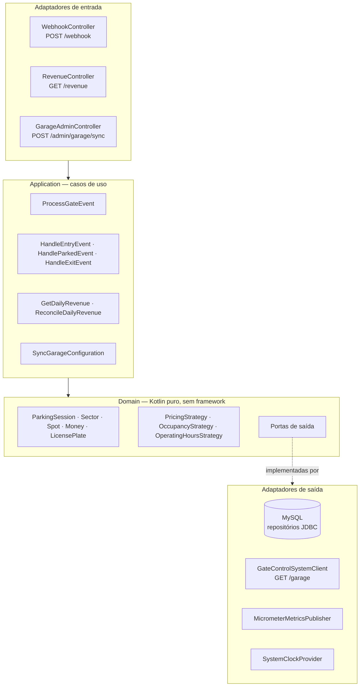

# teslapark-api

Serviço de gestão de estacionamento. Recebe os eventos publicados pelo sistema de cancelas,
controla a ocupação das vagas e apura a receita por setor.

**Stack:** Kotlin 2.1 · JVM 21 · Micronaut 4 · MySQL 8 · Arquitetura Hexagonal

| Documento | Conteúdo |
|---|---|
| [ADR-0001](docs/adr/0001-arquitetura-teslapark-api.md) | Decisões técnicas e suas justificativas, modelo de dados e requisitos não funcionais |
| [Especificações](docs/specs.md) | Plano de implementação — escopo, regras e critérios de aceite de cada entrega |
| [OpenAPI](docs/api/openapi.yaml) | Contrato da API, versionado. É a fonte de verdade |

---

## Subir o ambiente

```bash
make up
```

Constrói a imagem, sobe MySQL, o emulador do Gate Control System, a API, Prometheus e Grafana,
e aguarda o readiness. Não é preciso criar rede nem volume — o Compose cuida disso.

| Serviço | Endereço |
|---|---|
| API | http://localhost:3003 |
| Swagger UI | http://localhost:3003/swagger/index.html |
| Gate Control System (emulador) | http://localhost:3000 |
| Prometheus | http://localhost:9090 |
| Grafana | http://localhost:3001 |
| MySQL | `localhost:3306` |

O emulador só começa a publicar eventos **depois** que alguém consulta a configuração:

```bash
curl http://localhost:3000/garage
```

Demais alvos: `make down` derruba a stack, `make logs` acompanha, `make reset-db` recria o banco
vazio, `make smoke` valida o ambiente containerizado e `make test` roda a suíte completa.

---

## Arquitetura

A regra de dependência aponta para dentro: a infraestrutura conhece o domínio, nunca o contrário.



As políticas de negócio são interfaces (`PricingStrategy`, `OccupancyStrategy`,
`OperatingHoursStrategy`) com implementações injetadas — trocar a tabela de preços é registrar outra
implementação, não editar a existente.

**Por que hexagonal:** as regras que dão valor ao sistema — franquia de 30 minutos, hora cheia
arredondada para cima, multiplicador por faixa de lotação, fechamento a 100% — não têm nada a ver
com HTTP, JSON ou SQL, e são justamente as que mais mudam. Isoladas em Kotlin puro, elas rodam em
milissegundos, sem banco e sem subir contexto. Trocar MySQL por outro relacional, ou o emulador por
outra fonte de configuração, é escrever um adaptador novo.

Essa fronteira não é convenção: [`ArchitectureTest`](src/test/kotlin/com/teslapark/architecture/ArchitectureTest.kt)
reprova o build se o domínio importar Micronaut, JPA ou Jackson, se a camada de aplicação importar
persistência ou infraestrutura, se uma porta deixar de ser interface, ou se qualquer arquivo de
produção ganhar um comentário.

---

## Regras de negócio

**Tarifa**

```
duração = exit_time − entry_time
até 30 minutos            → R$ 0,00
acima de 30 minutos       → horas = ceil(duração em minutos ÷ 60)
                            valor = basePrice × horas × multiplicador
```

A primeira hora é cobrada integralmente e o arredondamento é sempre para cima. Dinheiro é
`BigDecimal` com `RoundingMode.CEILING`, nunca ponto flutuante, e a multiplicação é feita numa
única expressão — arredondar a cada passo cobraria centavos a mais.

**Preço dinâmico** — a lotação é medida no instante da entrada e o multiplicador fica congelado na
sessão, então o preço vigente na entrada é o preço cobrado, e o valor é reproduzível e auditável.

| Lotação | Faixa | Multiplicador |
|---|---|---|
| `< 25%` | `LOW` | `0,90` |
| `25% – 50%` | `NORMAL` | `1,00` |
| `50% – 75%` | `HIGH` | `1,10` |
| `75% – 100%` | `PEAK` | `1,25` |
| `= 100%` | `FULL` | entrada bloqueada |

**Lotação** — a cancela é única, então a decisão de permitir entrada é **global à garagem**, nunca
por setor. Com 100% de ocupação a garagem fecha; a primeira saída reabre.

**Idempotência** — o webhook não garante entrega exatamente-uma-vez. Cada evento tem uma chave
`SHA-256(tipo + placa + discriminador)` com índice único; a duplicata é no-op e responde `200`.

**Dado inconsistente nunca vira `5xx`** — `EXIT` sem `ENTRY`, `PARKED` em coordenada desconhecida e
evento fora de ordem são registrados como anomalia e respondem `200` com `status: IGNORED`. Um `4xx`
faria o produtor entrar em retry infinito de um dado que nunca ficará bom.

---

## Endpoints

O contrato completo está em [`docs/api/openapi.yaml`](docs/api/openapi.yaml) e a própria API o serve
navegável em **http://localhost:3003/swagger/index.html**, com `Try it out` já apontando para ela.

O arquivo continua com **fonte única**: o `processResources` copia `docs/api/openapi.yaml` para dentro
do artefato no build, então não existe uma segunda cópia versionada para sair de sincronia.

| Verbo | Rota | Descrição |
|---|---|---|
| `POST` | `/webhook` | Recebe `ENTRY`, `PARKED` e `EXIT` |
| `GET` | `/revenue?date=&sector=` | Receita do dia por setor |
| `POST` | `/revenue` | Mesma consulta, aceitando o corpo JSON `{ "date", "sector" }` |
| `POST` | `/admin/garage/sync` | Ressincroniza a configuração com o Gate Control System |
| `GET` | `/health` · `/health/liveness` · `/health/readiness` | Sondas de saúde |
| `GET` | `/metrics` | Métricas no formato Prometheus |

Erros seguem RFC 7807 em `application/problem+json`, com `type`, `title`, `status`, `detail`,
`instance`, `timestamp`, `requestId` e `errors[]`. Um `500` devolve apenas o `requestId` — nunca
stacktrace, SQL ou nome de tabela.

```bash
curl -X POST http://localhost:3003/webhook -H 'Content-Type: application/json' \
  -d '{"license_plate":"ZUL0001","entry_time":"2026-08-15T12:00:00.000Z","event_type":"ENTRY"}'
```

```bash
curl 'http://localhost:3003/revenue?date=2026-08-15&sector=A'
```

---

## Três decisões que fogem do óbvio

**`GET /revenue` também responde em `POST`.** O cliente legado envia a consulta no corpo de um `GET`.
O servidor Netty do Micronaut não decodifica corpo em `GET` — `HttpMethod.permitsRequestBody` exclui
o verbo, e os bytes são descartados antes de chegar à rota. A forma canônica passou a ser
`GET /revenue?date=&sector=`, e o payload legado é aceito em `POST /revenue`, com resposta idêntica.

**A vaga é marcada como ocupada no `PARKED`, não no `ENTRY`.** O evento de entrada traz apenas a
placa; qual vaga o veículo ocupou só se sabe no `PARKED`, que identifica a vaga por coordenada
geográfica. A decisão de lotação, essa sim, é tomada na entrada — ela conta **sessões abertas**
contra a capacidade total, então a garagem fecha no momento correto mesmo antes de qualquer
`PARKED` chegar.

**A janela de operação do setor não é aplicada.** `SectorOperatingHoursPolicy` existe e é testada, mas
nenhum caso de uso a invoca: os setores publicados pelo emulador trazem limites de permanência
(60 minutos no setor B) que rejeitariam o próprio fluxo de eventos que ele gera. A política fica
disponível como ponto de extensão, com a decisão registrada aqui em vez de escondida no código.

---

## Testes

```bash
./gradlew check
```

Roda compilação, `ktlint`, `detekt`, a suíte unitária, a suíte de integração e os portões de
cobertura. O build quebra se qualquer um reprovar.

| Suíte | Escopo | Tempo |
|---|---|---|
| `test` | Domínio, políticas e casos de uso com fakes em memória — sem I/O | ~1 s |
| `integrationTest` | MySQL 8 real via Testcontainers, contratos HTTP, concorrência e ponta a ponta | ~20 s |

Bancos em memória são proibidos: H2 mente sobre dialeto, locks e tipos decimais — justamente o que
precisa ser validado. O `EndToEndTest` sobe a **imagem real** do emulador e percorre o cenário
completo: encher a garagem, entrada negada, saída, entrada aceita e receita consistente.

| Portão | Mínimo | Atual |
|---|---|---|
| Cobertura do domínio | 90% | 94% |
| Cobertura global | 80% | 94% |

---

## Observabilidade

`GET /metrics` expõe as métricas de negócio — ocupação, vagas ocupadas, receita por setor, entradas
negadas, permanência, faixa tarifária aplicada, eventos do webhook por resultado e anomalias por
tipo — além das técnicas (latência por endpoint com histograma, pool JDBC, JVM, CPU).

Dois dashboards sobem provisionados em http://localhost:3001, sem clique nenhum:

| Dashboard | O que mostra |
|---|---|
| **Negócio** | Ocupação, receita por setor, faixa de preço, entradas negadas, permanência, anomalias |
| **Infraestrutura** | RPS, taxa de erro, latência p50/p95/p99, pool JDBC, heap, GC, CPU |

Logs saem em JSON estruturado quando `LOG_APPENDER=JSON`, com `requestId`, `traceId`, `eventType` e
`sessionId` no MDC. O `X-Request-Id` enviado pelo cliente é propagado; se ausente, é gerado.

---

## Variáveis de ambiente

Copie `.env.example` para `.env` — o `make up` faz isso automaticamente. Nenhum segredo é versionado.

| Variável | Padrão | Para que serve |
|---|---|---|
| `MYSQL_DATABASE` / `MYSQL_USER` / `MYSQL_PASSWORD` | `teslapark` | Credenciais do banco |
| `DATASOURCE_URL` | `jdbc:mysql://mysql:3306/teslapark` | Conexão da API |
| `GCS_BASE_URL` | `http://localhost:3000` | Onde a API busca `GET /garage` |
| `API_HOST_PORT` | `3003` | Porta publicada da API |
| `GARAGE_TIMEZONE` | `America/Sao_Paulo` | Fuso que define o dia da receita |
| `GARAGE_CURRENCY` | `BRL` | Moeda |
| `MICRONAUT_ENVIRONMENTS` | `dev` | Perfil (`dev`, `test`, `prod`) |
| `SECURITY_ENABLED` | `false` | Liga o gate de token bearer |
| `RATE_LIMIT_ENABLED` | `false` | Liga o limite de requisições por origem |
| `LOG_APPENDER` | `CONSOLE` | `JSON` para log estruturado |

A API compartilha o namespace de rede do emulador porque a imagem `garage-sim:1.0.0` resolve o
webhook em `localhost:3003` internamente, ignorando a variável de ambiente que documenta o
contrário. Sem isso os eventos não chegariam.
