# ADR-0001 — Arquitetura da Plataforma de Gestão de Estacionamento

| Campo | Valor |
|---|---|
| **Status** | Aceito |
| **Data** | 2026-08-15 |
| **Autores** | Kreverson |
| **Contexto** | Plataforma de operação de garagens — serviço de controle de vagas, eventos de cancela e faturamento |
| **Escopo** | Escolha de linguagem, framework, persistência, estilo arquitetural, modelo de dados, contrato de API e requisitos não funcionais |
| **Documentos relacionados** | Seção final deste arquivo: **DAS — Documento de Arquitetura de Software / NFRs** |

---

## 1. Contexto do problema

Precisamos construir um backend que opere uma garagem em tempo (quase) real. A garagem possui **um único grupo de cancelas na entrada**; os **setores são divisões lógicas** (contábeis/comerciais) do pool de vagas, não barreiras físicas. Isso tem uma consequência arquitetural direta: **a decisão de "pode entrar ou não" é global à garagem**, enquanto **preço e receita são por setor**.

### 1.1 Fluxo funcional

1. No boot, a aplicação consulta `GET /garage` no **Gate Control System (GCS)** — o sistema legado que controla fisicamente as cancelas — e persiste a configuração (setores, preço base, capacidade, janela de funcionamento, limite de permanência) e o inventário de vagas (id, setor, lat/lng).
2. O GCS passa a publicar eventos no webhook `POST /webhook`, em três tipos:
   - `ENTRY` — veículo cruzou a cancela (`license_plate`, `entry_time`);
   - `PARKED` — veículo estacionou em uma vaga, identificada por **coordenada geográfica** (`lat`, `lng`), não por id;
   - `EXIT` — veículo saiu (`license_plate`, `exit_time`), momento em que o valor é calculado.
3. A API expõe `GET /revenue` com a receita do dia por setor.

### 1.2 Regras de negócio que pressionam a arquitetura

| Regra | Pressão arquitetural |
|---|---|
| Primeiros 30 min grátis; após isso, tarifa fixa por hora **incluindo a primeira hora**, arredondada para cima | Cálculo monetário determinístico e testável isoladamente → domínio puro, sem framework |
| Preço dinâmico por faixa de lotação (−10% / 0% / +10% / +25%) | O preço depende de **estado global mutável no instante do evento** → exige congelamento do multiplicador e cuidado com concorrência |
| Com 100% de lotação a garagem fecha e só reabre com uma saída | Seção crítica sobre um contador global → risco de over-booking sob concorrência |
| Setores possuem `open_hour` / `close_hour` / `duration_limit_minutes` distintos (ex.: setor A 00:00–23:59/1440 min; setor B 08:00–23:59/60 min) | Regras variam por setor mesmo com cancela única → política de domínio parametrizada |
| Webhook externo, sem garantia de entrega exata | Necessidade de **idempotência** e tolerância a eventos duplicados e fora de ordem |

### 1.3 Restrições e premissas

- **Restrição de padronização técnica:** a plataforma padroniza JVM (Java 21 ou Kotlin 2.1.x), Spring ou Micronaut como framework e **MySQL** como banco relacional corporativo.
- **Premissa de dimensionamento:** permanência média de **30 minutos** por vaga (usada no DAS para projetar carga de 50 a 3.000 vagas).
- **Premissa de manutenção:** o serviço será mantido por rotação de times. **Legibilidade e testabilidade pesam mais do que performance bruta** neste volume — a arquitetura otimiza para o custo de mudança, não para o custo de execução.

### 1.4 Ambiguidades do contrato de integração (e como decidimos tratá-las)

| Ambiguidade | Tratamento adotado |
|---|---|
| `GET /revenue` é especificado com **corpo JSON** (`date`, `sector`), o que é atípico e mal suportado por proxies/clientes | Aceitamos **ambos**: query params (`?date=&sector=`) como forma canônica e corpo JSON para compatibilidade com o cliente legado |
| A documentação do GCS descreve `basePrice` (camelCase), mas a resposta real usa `base_price` (snake_case) e traz campos extras (`open_hour`, `close_hour`, `duration_limit_minutes`, `occupied`) | O adaptador de saída faz mapeamento tolerante a ambas as grafias; o domínio não conhece o formato do GCS |
| `PARKED` identifica a vaga por `lat`/`lng`, sujeito a ruído de ponto flutuante | Índice composto `(lat, lng)` com comparação por valor exato normalizado (`DECIMAL(9,6)`), com fallback para vaga livre do setor mais próximo |
| Não há definição do que ocorre se chega `EXIT` sem `ENTRY` correspondente | Evento é aceito (HTTP 200), registrado como anomalia e **não** gera receita — o webhook não deve entrar em loop de retry por dado sujo |
| A ordem dos eventos não é garantida | Máquina de estados da sessão só avança para frente; transições inválidas viram anomalia observável |

---

## 2. Decisão 1 — Linguagem: **Kotlin 2.1.x sobre JVM 21**

### 2.1 Opções consideradas

#### Opção A — Java 21

**Prós**

- Records + `sealed interface` + pattern matching em `switch` cobrem boa parte do que se busca em modelagem de domínio.
- Virtual Threads (Loom) maduros no 21, ótimos para workload I/O-bound como este.
- Maior base de desenvolvedores; menor risco de manutenção em times heterogêneos.
- Ferramental (profilers, IDEs, análise estática) é first-class, sem tradução.
- Nenhuma dependência de plugin de compilação adicional.

**Contras**

- Verbosidade residual em value objects, mapeamentos e builders — mais código para manter e revisar.
- Nulidade não faz parte do sistema de tipos; `Optional` é convenção, não garantia — relevante num domínio cheio de campos opcionais (`exit_time`, `spot_id`, `parked_at`).
- Imutabilidade exige disciplina (records ajudam, mas coleções continuam mutáveis por padrão).
- Sem `copy()` nativo, atualizar uma sessão imutável exige construtor completo ou builder à mão.

#### Opção B — Kotlin 2.1.x (escolhida)

**Prós**

- **Null-safety no compilador**: `exitTime: Instant?` versus `entryTime: Instant` documenta e força o tratamento das transições incompletas da sessão.
- **`data class` + `copy()`**: a sessão de estacionamento é uma máquina de estados imutável; evoluir estado vira uma expressão de uma linha.
- **`sealed interface` + `when` exaustivo** para `GarageEvent` (`Entry` / `Parked` / `Exit`): o compilador quebra o build se um novo tipo de evento não for tratado — proteção real contra o risco nº 1 do sistema (evento não tratado silenciosamente).
- **Value classes** (`@JvmInline value class LicensePlate`) evitam trocar placa por setor em parâmetros `String`, sem custo de alocação.
- O domínio puro fica compacto o suficiente para ser lido inteiro numa sessão de onboarding.
- Interoperabilidade 100% com o ecossistema JVM (Micronaut, Hibernate, Flyway, Testcontainers, JUnit 5).
- `kotest`/`MockK` e testes parametrizados deixam a tabela de preço dinâmico legível como especificação.

**Contras**

- Curva de aprendizado para times majoritariamente Java.
- Build ligeiramente mais lento (compilação Kotlin + KSP/KAPT para o Micronaut).
- Interop com bibliotecas que exigem construtor sem argumentos e propriedades mutáveis (JPA/Hibernate) requer o plugin `all-open`/`no-arg` — configuração extra e uma pegadinha conhecida com `data class` em entidades.
- Stacktraces podem incluir frames sintéticos, dificultando marginalmente o debug.

#### Opção C — outra linguagem (Go, Node/TypeScript)

Descartada por **violar a padronização técnica da plataforma**, que é JVM. Registrada apenas para deixar claro que a alternativa foi considerada e não é uma omissão.

### 2.2 Decisão

**Adotamos Kotlin 2.1.x sobre JVM 21 (toolchain 21, `jvmTarget = 21`).**

A justificativa central: o núcleo deste sistema é uma **máquina de estados com regras monetárias**, e Kotlin move para o compilador exatamente as três classes de erro que mais custam aqui — nulo inesperado numa sessão incompleta, tipo de evento não tratado e mutação acidental de estado que já foi faturado. Java 21 chega perto com records e sealed types, mas ainda paga verbosidade em cada value object e não oferece null-safety.

### 2.3 Consequências

**Positivas**

- Transições inválidas de sessão viram erro de compilação, não bug em produção.
- Menos código de infraestrutura, mais densidade de regra de negócio por arquivo.
- Testes de regra de preço ficam declarativos e servem como documentação viva.

**Negativas / mitigações**

- *Entidades JPA em Kotlin*: usaremos **classes normais (não `data class`) na camada de persistência**, com os plugins `kotlin-jpa`/`all-open`; as `data class` ficam restritas ao domínio. Isso evita `equals`/`hashCode` sobre entidades gerenciadas — armadilha clássica.
- *Onboarding*: convenções documentadas em `CONTRIBUTING.md`; o código evita construções idiomáticas exóticas (DSLs, `infix`, receivers aninhados) para permanecer legível a quem vem de Java.
- Build configurado com Gradle Kotlin DSL e cache de compilação para conter o custo de build.

---

## 3. Decisão 2 — Framework: **Micronaut 4.x**

### 3.1 Opções consideradas

#### Opção A — Spring Boot 3.x

**Prós**

- Ecossistema mais amplo do mercado JVM; qualquer problema já foi resolvido por alguém.
- Spring Data JPA reduz drasticamente o código de repositório.
- Actuator + Micrometer entregam health, métricas e tracing praticamente sem configuração.
- Maior probabilidade de familiaridade prévia do time.

**Contras**

- DI em **runtime** via reflexão e proxies: startup mais lento e maior consumo de memória.
- Muita "mágica" implícita — autoconfigurações que dificultam explicar exatamente por que algo funciona.
- Facilita o antipadrão de vazar anotações do framework para dentro do domínio, corroendo a arquitetura hexagonal.

#### Opção B — Micronaut 4.x (escolhida)

**Prós**

- **DI e AOP resolvidos em tempo de compilação** (via annotation processor): sem reflexão em runtime, startup na casa de dezenas/centenas de milissegundos e footprint de memória menor — relevante para escalar horizontalmente e para o pico de eventos do webhook.
- Erros de wiring aparecem **no build**, não no boot — coerente com a filosofia "empurrar erros para o compilador" já adotada na Decisão 1.
- `micronaut-data-jdbc` / `data-jpa`, `micronaut-flyway`, `micronaut-micrometer` e `micronaut-management` cobrem persistência e observabilidade nativamente.
- Modelo de execução explícito (`@ExecuteOn(TaskExecutors.BLOCKING)`) torna óbvio o que é bloqueante — importante porque o webhook faz I/O de banco no caminho crítico.
- Menor superfície de "mágica": o código gerado é inspecionável, o que ajuda na defesa técnica do projeto.
- Suporte de primeira classe a Kotlin (KSP), inclusive coroutines, sem plugins de terceiros.

**Contras**

- Comunidade e volume de material menores que Spring — soluções para casos de borda demandam mais leitura de documentação oficial.
- Compilação mais lenta (processamento de anotações no build).
- Menor familiaridade média do mercado; exige que o README explique as escolhas.
- Algumas integrações de terceiros assumem Spring e precisam de adaptação manual.

### 3.2 Decisão

**Adotamos Micronaut 4.x com KSP.**

Racional: o perfil de carga (ver DAS) é de **muitos eventos pequenos e I/O-bound**, onde startup rápido, baixo footprint e escala horizontal barata importam mais do que a amplitude do ecossistema. E o modelo de compile-time DI reforça a mesma propriedade que motivou Kotlin: **falhar cedo, no build**. Somado à arquitetura hexagonal, o Micronaut reduz o incentivo a espalhar anotações pelo domínio.

### 3.3 Consequências

**Positivas**

- Startup rápido → escala horizontal e rollout ágil; caminho aberto para GraalVM Native Image se o custo de runtime virar prioridade.
- Wiring validado em build time reduz uma classe inteira de falhas de deploy.
- Baixo consumo de memória por instância reduz custo de infraestrutura em operação multi-garagem.

**Negativas / mitigações**

- *Menor material disponível*: decisões não óbvias serão comentadas no código e no README; ficamos nas integrações oficiais do Micronaut.
- *Build mais lento*: build incremental do Gradle + cache; CI com cache de dependências e do KSP.
- *Portabilidade*: como o domínio não depende do framework (hexagonal), uma eventual migração para Spring afetaria apenas os adaptadores — o custo do "erro" desta decisão é limitado por construção.

---

## 4. Decisão 3 — Persistência: **MySQL 8.x (relacional)**

### 4.1 Opções consideradas

#### Opção A — MongoDB (não relacional / documento)

**Prós**

- Schema flexível absorve variações do payload do GCS sem migração.
- Um documento por sessão de estacionamento agrega tudo (entrada, vaga, saída, valor) — leitura por placa em um único acesso.
- Escala horizontal por sharding é nativa e simples de operar.
- Escritas append-only de eventos são muito rápidas.

**Contras (decisivos aqui)**

- **Não há tipo decimal nativo idiomático de uso trivial**: valores monetários dependem de `Decimal128`, cujo suporte via driver/ORM é mais atritado; ponto flutuante em dinheiro é inaceitável.
- **Transações multi-documento existem, mas são custosas e exigem replica set.** Nosso caso mais crítico — "ocupar vaga + incrementar contador global + verificar lotação" — é exatamente uma transação multi-entidade.
- **Agregação de receita por setor/dia** é o caso de uso canônico de `GROUP BY`; em Mongo vira aggregation pipeline mais verboso e menos otimizável.
- **Unicidade e integridade referencial** (uma vaga ocupada por no máximo um veículo; sessão apontando para vaga existente) precisariam ser garantidas na aplicação, não no banco — mais código e mais risco.
- **Violaria a padronização de banco da plataforma** (MySQL).

#### Opção B — PostgreSQL (relacional)

**Prós**

- `NUMERIC` de precisão arbitrária, o melhor tipo monetário do mercado.
- `SELECT ... FOR UPDATE SKIP LOCKED` maduro, ideal para alocação de vagas concorrente sem contenção.
- Índices parciais (ex.: só sobre sessões abertas), `GENERATED` columns, extensões geoespaciais (PostGIS) para o casamento por `lat`/`lng`.
- `JSONB` indexável permite armazenar o payload cru do webhook mantendo o relacional para o resto — modelo híbrido de fato.
- MVCC com escritores que não bloqueiam leitores.

**Contras**

- **Violaria a padronização de banco da plataforma.**
- Operacionalmente exige mais atenção (vacuum/bloat, tuning de autovacuum) que MySQL no dia a dia.

#### Opção C — MySQL 8.x (escolhida)

**Prós**

- **Atende à padronização de banco da plataforma** — banco já operado, monitorado e com backup pelo time de infraestrutura.
- `DECIMAL(10,2)` resolve dinheiro corretamente, sem ponto flutuante.
- InnoDB entrega transações ACID, chaves estrangeiras e `SELECT ... FOR UPDATE` — cobre a seção crítica de ocupação de vaga.
- A partir do 8.0: CTEs, window functions e `SELECT ... FOR UPDATE SKIP LOCKED`, o que fecha a lacuna funcional mais relevante frente ao Postgres para este caso.
- Índices clusterizados por PK favorecem consultas por sessão/placa.
- Ubiquidade operacional: RDS/Aurora/Cloud SQL, backup e replicação bem trilhados.

**Contras**

- Tipos espaciais e índices geoespaciais menos ricos que PostGIS (mitigado: usamos igualdade sobre `DECIMAL(9,6)` normalizado, não busca por proximidade).
- Sem índices parciais (mitigado com índice composto `(status, sector_id)` e coluna gerada).
- `JSON` menos performático e menos indexável que `JSONB` (aceitável: o payload cru é escrito e raramente lido).
- DDL e comportamento de `utf8mb4`/collation exigem atenção em migração.

#### Opção D — Híbrido (MySQL para transacional + Mongo/Redis para eventos)

Descartada **por ora**: introduz consistência eventual e um segundo runtime para um volume que uma única instância MySQL absorve com folga (ver DAS — pico de 15 req/s a 3.000 vagas). Registrada como caminho de evolução caso a operação passe a agregar dezenas de garagens.

### 4.2 Decisão

**Adotamos MySQL 8.x com InnoDB, migrações versionadas por Flyway e valores monetários em `DECIMAL(10,2)`.**

Justificativa do **modelo relacional** (independentemente da restrição): o domínio é intrinsecamente relacional e **transacional** — vagas pertencem a setores, sessões referenciam vaga e veículo, e a regra "não permitir entrada com garagem cheia" é uma **invariante global que só um banco transacional garante barato**. Receita por setor/dia é agregação relacional clássica. Dinheiro exige tipo decimal exato. Nenhum dos benefícios do modelo de documento (schema flexível, escala de escrita massiva) é necessário no volume projetado.

Justificativa do **MySQL especificamente**: é o banco relacional padronizado na plataforma, e o MySQL 8 possui todos os recursos que o caso demanda. Se a escolha fosse livre, o ADR registraria PostgreSQL como marginalmente superior (índices parciais, `NUMERIC`, PostGIS, `JSONB`) — mas a diferença **não é material** neste domínio.

### 4.3 Consequências

**Positivas**

- Integridade referencial e unicidade delegadas ao banco → menos código defensivo.
- Invariante de lotação garantida por transação + lock, não por coordenação em memória (o que quebraria com mais de uma instância).
- Relatórios de receita são SQL simples, auditáveis e otimizáveis por índice.

**Negativas / mitigações**

- *Banco como ponto único de escala de escrita*: mitigado pelo volume real (ver DAS) e por réplica de leitura para `/revenue` quando necessário.
- *Lock em linha quente (contador de ocupação)*: mitigado usando `SELECT ... FOR UPDATE SKIP LOCKED` sobre a **vaga**, e derivando a ocupação por contagem indexada em vez de manter um contador global serializado.
- *Acoplamento a dialeto*: proibido usar SQL proprietário fora dos adaptadores; Flyway com SQL padrão sempre que possível, mantendo aberta a porta para PostgreSQL.
- *Crescimento da tabela de eventos*: política de retenção e particionamento definidos no DAS.

### 4.4 Decisões complementares de persistência

| Decisão | Justificativa |
|---|---|
| **Flyway** para migração versionada | Schema como código, auditável em commits e reprodutível em qualquer ambiente |
| **`DECIMAL(10,2)`** para dinheiro; `BigDecimal` com `RoundingMode.CEILING` na aplicação | A política tarifária exige arredondamento para cima; float é proibido em moeda |
| **Timestamps em UTC** (`TIMESTAMP(3)`), conversão para `America/Sao_Paulo` só na borda | Eventos chegam em ISO-8601 com `Z`; "receita do dia" é conceito local e precisa de fuso explícito |
| **Tabela de eventos brutos (`webhook_event`)** com payload JSON e chave de idempotência | Permite reprocessamento, auditoria e depuração de eventos fora de ordem |
| **Chave de idempotência** = hash de (`event_type`, `license_plate`, timestamp do evento) com índice único | Webhooks não garantem entrega exatamente-uma-vez; duplicata vira no-op e responde 200 |
| **Soft state da vaga**: `occupied` é derivado da sessão ativa e mantido como coluna denormalizada dentro da mesma transação | Leitura rápida de disponibilidade sem perder consistência |

---

## 5. Decisão 4 — Estilo arquitetural: **Arquitetura Hexagonal (Ports & Adapters)**

### 5.1 O problema que estamos resolvendo com estilo arquitetural

As regras que dão valor a este sistema — franquia de 30 minutos, tarifa por hora cheia arredondada para cima, multiplicador por faixa de lotação, fechamento a 100% — **não têm nada a ver com HTTP, JSON, JPA ou MySQL**. Mas são exatamente as que mais mudam (uma tabela de preços muda muito mais que um driver de banco) e as que mais precisam de teste.

Ao mesmo tempo, o sistema tem **duas bordas de entrada assimétricas** (webhook empurrado pelo GCS e API REST consultada por clientes) e **uma borda de saída externa** (o próprio GCS, em `GET /garage`), além do banco. Um estilo que separe núcleo de bordas se paga imediatamente.

### 5.2 Opções consideradas

#### Opção A — Camadas tradicionais (Controller → Service → Repository)

**Prós:** familiar a qualquer desenvolvedor; menos arquivos; entrega inicial mais rápida; padrão do Spring/Micronaut "out of the box".

**Contras:** a camada de serviço tende a depender de entidades JPA, e o domínio passa a ser modelado pelo schema do banco (anemic domain model); testar a regra de preço acaba exigindo subir contexto de aplicação; trocar a fonte de configuração da garagem (GCS → arquivo → outro serviço) toca o serviço; a dependência aponta "para dentro do banco", invertendo a importância real das coisas.

#### Opção B — Arquitetura Hexagonal / Ports & Adapters (escolhida)

**Prós**

- **Domínio sem dependência de framework**: `PricingPolicy`, `ParkingSession`, `OccupancyRate` são Kotlin puro, testáveis em milissegundos, sem Micronaut, sem banco, sem HTTP.
- **Inversão de dependência**: o núcleo define as *portas* (interfaces) e a infraestrutura as implementa. Trocar MySQL por Postgres, ou o GCS por outra fonte de configuração, é escrever um adaptador novo — não tocar em regra de negócio.
- **Simetria de entradas**: webhook e REST são dois adaptadores diferentes sobre os *mesmos* casos de uso. Sem duplicação de regra entre as bordas.
- **Testes em pirâmide natural**: muitos testes de domínio (rápidos, sem I/O), poucos de integração com Testcontainers, pouquíssimos ponta-a-ponta contra o GCS.
- **Legibilidade estrutural**: a estrutura de pastas conta a história do negócio, não do framework — `domain/pricing`, `domain/session`, `application/usecase` são autoexplicativos.
- Combina com as decisões anteriores: sealed classes e value classes só rendem de fato num domínio livre de anotações de persistência.

**Contras**

- Mais artefatos: entidade de domínio + entidade JPA + mapeador, em vez de uma classe só.
- Indireção adicional pode parecer over-engineering num escopo pequeno.
- Risco de "hexagonal cargo cult": criar porta para tudo, inclusive para o que nunca vai variar.
- Mapeamento domínio↔persistência é código repetitivo a manter.

#### Opção C — Clean Architecture (4 anéis) / Vertical Slice / CQRS

**Clean Architecture** é essencialmente o mesmo princípio com mais cerimônia de nomenclatura (entities/use cases/interface adapters/frameworks); adotaríamos os mesmos benefícios com mais camadas do que este escopo justifica.
**Vertical Slice** entregaria coesão por feature, mas fragmenta regras compartilhadas (preço é usado por saída e por consulta) e dificulta manter uma única fonte de verdade da tarifa.
**CQRS com event sourcing** seria conceitualmente elegante (o sistema *já é* um fluxo de eventos ENTRY/PARKED/EXIT), e é o caminho natural se a auditoria virar requisito forte — mas introduz projeções, versionamento de eventos e consistência eventual sem demanda que justifique esse custo hoje. **Registrado como evolução, não como decisão atual.**

### 5.3 Decisão

**Adotamos Arquitetura Hexagonal (Ports & Adapters), com três módulos/pacotes de dependência unidirecional: `domain` ← `application` ← `infrastructure`.**

```
┌──────────────────────── ADAPTADORES DE ENTRADA ────────────────────────┐
│  WebhookController (POST /webhook)      RevenueController (GET /revenue)│
│  GarageStatusController                 (Micronaut HTTP, DTOs, validação)│
└──────────────┬───────────────────────────────────┬─────────────────────┘
               │ implementa/chama portas de entrada │
┌──────────────▼───────────────────────────────────▼─────────────────────┐
│                          APPLICATION (casos de uso)                     │
│  HandleEntryEvent · HandleParkedEvent · HandleExitEvent                  │
│  GetDailyRevenue · SyncGarageConfiguration · GetGarageStatus             │
│              (orquestração, transação, idempotência)                    │
├─────────────────────────────────────────────────────────────────────────┤
│                       DOMAIN (Kotlin puro, sem framework)               │
│  ParkingSession (máquina de estados) · Sector · Spot · LicensePlate      │
│  PricingPolicy (franquia 30min + hora cheia + multiplicador dinâmico)    │
│  OccupancyPolicy (fechamento a 100%) · OperatingHoursPolicy              │
│  Portas de saída: SessionRepository, SpotRepository, SectorRepository,   │
│                   RevenueRepository, GarageConfigProvider, Clock         │
└──────────────┬───────────────────────────────────┬─────────────────────┘
               │ implementadas por                  │
┌──────────────▼───────────────────────────────────▼─────────────────────┐
│                     ADAPTADORES DE SAÍDA (infrastructure)               │
│  MySqlSessionRepository (JPA/JDBC) · MySqlSpotRepository                 │
│  MySqlRevenueRepository · SimulatorGarageClient (HTTP GET /garage)       │
│  SystemClock · MicrometerMetricsPublisher                               │
└─────────────────────────────────────────────────────────────────────────┘
```

**Regra de dependência (verificada automaticamente):** nada em `domain` importa `io.micronaut.*`, `jakarta.persistence.*` ou `com.fasterxml.*`. Isso é validado por um teste **ArchUnit/Konsist** no CI — a arquitetura vira asserção executável, não convenção documental.

### 5.4 Por que hexagonal especificamente neste problema

| Fato do problema | O que a hexagonal resolve |
|---|---|
| A configuração da garagem vem de um **sistema legado externo (GCS)**, com ciclo de vida próprio | `GarageConfigProvider` é uma porta; o GCS é um adaptador substituível por arquivo ou outro serviço sem tocar o núcleo |
| O preço dinâmico é a regra mais provável de mudar | `PricingPolicy` isolada, com testes tabelados cobrindo as quatro faixas e as bordas exatas (24,99% / 25% / 50% / 75% / 100%) |
| Eventos chegam duplicados e fora de ordem | Idempotência e ordenação vivem na camada de aplicação; o domínio só conhece transições válidas |
| Duas bordas de entrada (webhook e REST) sobre as mesmas regras | Ambas chamam os mesmos casos de uso; zero duplicação de regra |
| Testar preço não pode exigir MySQL | Domínio puro → testes de milissegundos; Testcontainers fica só para os adaptadores |
| A padronização "MySQL" é externa e pode mudar | Trocar de banco = novo adaptador; o ADR já documenta que o custo do erro é contido |

### 5.5 Consequências

**Positivas**

- Regras de negócio testáveis sem infraestrutura → suíte rápida, feedback curto, cobertura significativa onde importa.
- O custo de errar as Decisões 2 e 3 (framework e banco) fica **contido nos adaptadores** — a hexagonal é o seguro que barateia as outras decisões.
- Estrutura de código legível como negócio: o nome do pacote informa a regra, não o framework.
- Caminho aberto para evoluir a borda de entrada (fila/Kafka no lugar de HTTP) sem reescrever regra.

**Negativas / mitigações**

- *Mais classes e mapeamentos*: mitigado limitando portas ao que realmente varia (banco, relógio, configuração externa) e evitando abstrair o que nunca terá segunda implementação.
- *Curva de leitura*: README com o diagrama acima e um "mapa de pastas"; nomes de pacote no idioma do negócio.
- *Boilerplate de mapeamento*: funções de extensão Kotlin (`Entity.toDomain()`, `Domain.toEntity()`) mantidas junto ao adaptador, testadas por round-trip.
- *Risco de excesso*: revisão explícita no code review — "esta porta tem chance real de ter outra implementação?".

---

## 6. Decisões complementares (registro resumido)

| # | Decisão | Alternativa descartada | Justificativa | Consequência |
|---|---|---|---|---|
| 6.1 | **Idempotência no webhook** via chave única `(event_type, license_plate, event_time)` | Confiar na entrega exatamente-uma-vez | Webhooks reentregam; duplicata não pode gerar receita dupla | Duplicata é no-op e retorna 200; exige índice único e tratamento de violação |
| 6.2 | **Responder 200 sempre que o evento for aceitável**, registrando anomalias | Retornar 4xx para dado inconsistente | 4xx faz o produtor entrar em retry infinito de um dado que nunca ficará bom | Erros de negócio viram métrica/alerta, não status HTTP |
| 6.3 | **Alocação de vaga com `SELECT ... FOR UPDATE SKIP LOCKED`** | Lock otimista com retry; contador global em memória | Evita over-booking sem serializar toda a garagem; funciona com N instâncias | Depende de transação curta; exige índice adequado |
| 6.4 | **Congelar o multiplicador dinâmico no instante do `ENTRY`** e persistir na sessão | Calcular na saída pela lotação corrente | Previsibilidade e justiça com o cliente: o preço vigente na entrada é o cobrado; torna o valor reproduzível e auditável | Requer colunas `occupancy_rate_at_entry` e `price_multiplier`; documentar a regra publicamente |
| 6.5 | **Lotação avaliada globalmente** (cancela única), **preço e receita por setor** | Lotação por setor | Setor é divisão lógica e comercial; a cancela é única, logo a entrada é liberada se houver vaga em qualquer setor | Cálculo de ocupação usa total da garagem; receita agrupa por setor da vaga ocupada |
| 6.6 | **Snapshot diário de receita por setor** (`sector_daily_revenue`) atualizado na saída | Agregar `SUM()` sob demanda | `GET /revenue` fica O(1) e a receita histórica não muda se a tarifa mudar | Precisa ser atualizado na mesma transação da saída; job de reconciliação para conferir contra as sessões |
| 6.7 | **Sincronização da garagem no boot com retry/backoff**, e endpoint administrativo de re-sync | Sincronizar só uma vez, falhando o boot | O GCS pode estar indisponível no momento do boot; a aplicação não pode morrer por isso | Estado "não configurado" precisa ser explícito no health check |
| 6.8 | **Erros no padrão RFC 7807 (`application/problem+json`)** | Formato de erro ad-hoc | Contrato de erro previsível e padronizado para todos os endpoints | Handler global de exceções mapeando exceções de domínio → status |
| 6.9 | **Observabilidade com Micrometer + OpenTelemetry desde o dia 1** | Instrumentar depois | Os NFRs do DAS só são verificáveis se houver métrica | Dependência de `micronaut-micrometer` e endpoints de management protegidos |
| 6.10 | **Testcontainers (MySQL real) nos testes de integração** | Banco em memória (H2) | H2 mente sobre dialeto, locks e tipos — justo o que precisamos validar | CI precisa de Docker; suíte de integração mais lenta (isolada em outro *source set*) |

---

## 7. Modelo Entidade-Relacionamento (MySQL 8)

### 7.1 Diagrama

```mermaid
erDiagram
    GARAGE                ||--||  GARAGE_STATE          : "1..1"
    GARAGE                ||--o{  SECTOR                 : "1..N"
    SECTOR                ||--o{  PARKING_SPOT           : "1..N"
    SECTOR                ||--o{  SECTOR_DAILY_REVENUE   : "1..N"
    PARKING_SESSION       }o--||  VEHICLE                : "N..1"
    PARKING_SESSION       }o--||  SECTOR                 : "N..1"
    PARKING_SESSION       }o--o|  PARKING_SPOT           : "N..1 (0..1 ate o PARKED)"
    PARKING_SESSION       ||--o{  WEBHOOK_EVENT          : "1..N"
    PARKING_SESSION       ||--o{  SESSION_ANOMALY        : "1..N"

    GARAGE {
        bigint   id                      PK "AUTO_INCREMENT"
        varchar  name                    UK "identificador da garagem"
        varchar  timezone                   "default America/Sao_Paulo"
        varchar  currency                   "ISO-4217, default BRL"
        datetime created_at
        datetime updated_at
    }

    GARAGE_STATE {
        bigint   garage_id               PK "FK 1..1 para GARAGE"
        int      total_capacity             "soma das capacidades dos setores"
        int      occupied_spots            "vagas ocupadas agora"
        decimal  occupancy_rate            "DECIMAL(5,4) derivado"
        boolean  closed_by_capacity        "true quando lotacao = 100%"
        datetime last_sync_at              "ultimo GET /garage bem sucedido"
        varchar  config_status             "PENDING | SYNCED | STALE"
        bigint   version                   "lock otimista"
        datetime updated_at
    }

    SECTOR {
        bigint   id                      PK "AUTO_INCREMENT"
        bigint   garage_id               FK "N..1 para GARAGE"
        varchar  code                    UK "A, B, ... unico por garagem"
        decimal  base_price                 "DECIMAL(10,2) - tarifa base do setor"
        int      max_capacity              "capacidade logica do setor"
        time     open_hour                 "ex 00:00 / 08:00"
        time     close_hour                "ex 23:59"
        int      duration_limit_minutes    "ex 1440 / 60"
        datetime created_at
        datetime updated_at
    }

    PARKING_SPOT {
        bigint   id                      PK "AUTO_INCREMENT"
        bigint   external_id             UK "id da vaga no GCS"
        bigint   sector_id               FK "N..1 para SECTOR"
        decimal  lat                        "DECIMAL(9,6) normalizado"
        decimal  lng                        "DECIMAL(9,6) normalizado"
        boolean  occupied                   "denormalizado, escrito na mesma transacao"
        bigint   current_session_id         "FK opcional para a sessao ativa"
        datetime created_at
        datetime updated_at
    }

    VEHICLE {
        bigint   id                      PK "AUTO_INCREMENT"
        varchar  license_plate           UK "normalizada em maiusculas"
        datetime first_seen_at
        datetime last_seen_at
    }

    PARKING_SESSION {
        bigint   id                      PK "AUTO_INCREMENT"
        bigint   vehicle_id              FK "N..1 para VEHICLE"
        bigint   sector_id               FK "N..1 para SECTOR"
        bigint   spot_id                 FK "N..1 - nulo ate o evento PARKED"
        varchar  status                     "ENTERED | PARKED | EXITED | CANCELLED"
        datetime entry_time                 "TIMESTAMP(3) UTC"
        datetime parked_time                "TIMESTAMP(3) UTC, nulo ate PARKED"
        datetime exit_time                  "TIMESTAMP(3) UTC, nulo ate EXIT"
        int      duration_minutes           "calculado na saida"
        decimal  base_price_applied         "DECIMAL(10,2) congelado na entrada"
        decimal  occupancy_rate_at_entry    "DECIMAL(5,4) congelado na entrada"
        decimal  price_multiplier           "DECIMAL(4,3): 0.900/1.000/1.100/1.250"
        int      billed_hours               "horas cheias arredondadas para cima"
        decimal  amount_charged             "DECIMAL(10,2), 0 se ate 30 min"
        char     currency                   "CHAR(3), BRL"
        date     revenue_date               "data local da SAIDA, para agregacao"
        bigint   version                    "lock otimista"
        datetime created_at
        datetime updated_at
    }

    SECTOR_DAILY_REVENUE {
        bigint   id                      PK "AUTO_INCREMENT"
        bigint   sector_id               FK "N..1 para SECTOR"
        date     revenue_date            UK "unique composto (sector_id, revenue_date)"
        decimal  total_amount               "DECIMAL(14,2) acumulado"
        int      sessions_count            "quantidade de saidas faturadas"
        int      free_sessions_count       "saidas dentro da franquia de 30 min"
        char     currency                   "CHAR(3), BRL"
        datetime updated_at
    }

    WEBHOOK_EVENT {
        bigint   id                      PK "AUTO_INCREMENT"
        char     idempotency_key         UK "CHAR(64) SHA-256 de tipo+placa+timestamp"
        varchar  event_type                 "ENTRY | PARKED | EXIT"
        varchar  license_plate              "sem FK: evento pode chegar antes do veiculo"
        bigint   session_id              FK "N..1 - preenchido apos correlacao"
        datetime event_time                 "timestamp do evento na origem"
        datetime received_at                "quando chegou no webhook"
        datetime processed_at               "nulo enquanto pendente"
        varchar  processing_status          "RECEIVED | PROCESSED | DUPLICATE | FAILED"
        json     raw_payload                "corpo original para auditoria e replay"
    }

    SESSION_ANOMALY {
        bigint   id                      PK "AUTO_INCREMENT"
        bigint   session_id              FK "N..1 - nulo se nao correlacionou"
        bigint   webhook_event_id        FK "evento que originou a anomalia"
        varchar  anomaly_type               "EXIT_WITHOUT_ENTRY | DUPLICATE_ENTRY | ..."
        varchar  description
        datetime detected_at
        boolean  resolved
    }
```



### 7.2 Leitura das cardinalidades

| Relacionamento | Cardinalidade | Por quê |
|---|---|---|
| `GARAGE` → `GARAGE_STATE` | **1..1** | Estado operacional agregado (lotação, aberta/fechada, status do sync) é linha única por garagem; isola a linha "quente" das tabelas de volume |
| `GARAGE` → `SECTOR` | **1..N** | A garagem tem N setores lógicos (A, B, …) |
| `SECTOR` → `PARKING_SPOT` | **1..N** | Cada vaga pertence a exatamente um setor |
| `PARKING_SESSION` → `VEHICLE` | **N..1** | Um veículo tem N sessões ao longo do tempo; cada sessão é de um único veículo |
| `PARKING_SESSION` → `SECTOR` | **N..1** | Denormalizado deliberadamente: preserva o setor faturado mesmo se a vaga for remanejada |
| `PARKING_SESSION` → `PARKING_SPOT` | **N..1**, sendo **0..1** do lado da vaga | `ENTRY` cria a sessão sem vaga; só o `PARKED` (via lat/lng) atribui a vaga. Historicamente, uma vaga acumula N sessões |
| `PARKING_SESSION` → `WEBHOOK_EVENT` | **1..N** | Uma sessão é composta por até 3 eventos (ENTRY, PARKED, EXIT), mais duplicatas registradas |
| `SECTOR` → `SECTOR_DAILY_REVENUE` | **1..N** | Uma linha de receita por setor por dia |
| `PARKING_SESSION` → `SESSION_ANOMALY` | **1..N** | Eventos inconsistentes viram registro auditável em vez de exceção silenciosa |

### 7.3 Invariantes garantidas pelo banco

| Invariante | Implementação em MySQL 8 |
|---|---|
| Uma placa não pode ter duas sessões abertas | Coluna gerada `active_plate` = `license_plate` quando `status <> 'EXITED'`, senão `NULL` + `UNIQUE (active_plate)` — substitui o índice parcial que o MySQL não possui |
| Uma vaga não pode ter dois veículos | `UNIQUE (current_session_id)` em `parking_spot` + alocação sob `SELECT ... FOR UPDATE SKIP LOCKED` |
| Idempotência do webhook | `UNIQUE (idempotency_key)` — a violação é capturada e traduzida em `DUPLICATE`, respondendo 200 |
| Uma linha de receita por setor/dia | `UNIQUE (sector_id, revenue_date)` + `INSERT ... ON DUPLICATE KEY UPDATE` |
| Dinheiro nunca em ponto flutuante | Todas as colunas monetárias em `DECIMAL`; `BigDecimal` na aplicação |
| Integridade referencial | Chaves estrangeiras InnoDB com `ON DELETE RESTRICT` |

### 7.4 Índices previstos

| Tabela | Índice | Consulta que atende |
|---|---|---|
| `parking_session` | `UNIQUE (active_plate)` | Localizar a sessão aberta no `EXIT` — caminho crítico |
| `parking_session` | `(sector_id, revenue_date)` | Reconciliação de receita e relatórios |
| `parking_session` | `(status, entry_time)` | Contagem de ocupação e sessões estagnadas |
| `parking_spot` | `UNIQUE (lat, lng)` | Casamento do evento `PARKED` por coordenada |
| `parking_spot` | `(sector_id, occupied)` | Busca de vaga livre por setor |
| `webhook_event` | `UNIQUE (idempotency_key)` | Deduplicação |
| `webhook_event` | `(received_at)` | Expurgo/particionamento por retenção |
| `sector_daily_revenue` | `UNIQUE (sector_id, revenue_date)` | `GET /revenue` em acesso único |

---

## 8. Contrato da API

### 8.1 Convenções gerais

- **Base URL:** `http://localhost:3003`
- **Content-Type:** `application/json; charset=utf-8`
- **Erros:** RFC 7807 — `application/problem+json`
- **Datas:** ISO-8601 em UTC (`2026-08-15T12:00:00.000Z`) nos eventos; `revenue` usa data local (`America/Sao_Paulo`)
- **Correlação:** todo request aceita e propaga `X-Request-Id`; se ausente, é gerado
- **Autenticação:** o webhook do GCS trafega em rede privada e é autenticado por IP allowlist. Os endpoints administrativos e de consulta exigem `Authorization: Bearer <token>` quando o perfil `secure` está ativo

**Envelope de erro padrão:**

```json
{
  "type": "https://api.teslapark.local/errors/garage-full",
  "title": "Garage is full",
  "status": 409,
  "detail": "No spots available. Entry denied until a vehicle exits.",
  "instance": "/webhook",
  "timestamp": "2026-08-15T12:00:00.000Z",
  "requestId": "6d1f9b2e-4c3a-4f0b-9a1d-2f7e1c8b5a44",
  "errors": []
}
```

**Catálogo de status:**

| Status | Quando ocorre | Corpo |
|---|---|---|
| `200 OK` | Evento processado, duplicado (no-op) ou consulta bem-sucedida | Payload do endpoint |
| `201 Created` | Sincronização de garagem criou configuração nova | Resumo da configuração |
| `400 Bad Request` | JSON malformado, campo obrigatório ausente, data inválida | `problem+json` com `errors[]` |
| `401 Unauthorized` | Token ausente, expirado ou inválido | `problem+json` |
| `403 Forbidden` | Token válido, mas sem escopo para a operação (*not authorized*) | `problem+json` |
| `404 Not Found` | Setor, placa ou vaga inexistente | `problem+json` |
| `409 Conflict` | Garagem lotada; sessão já aberta para a placa; transição de estado inválida | `problem+json` |
| `422 Unprocessable Entity` | Sintaxe válida, semântica impossível (ex.: `exit_time` anterior ao `entry_time`) | `problem+json` |
| `429 Too Many Requests` | Rate limit por origem excedido | `problem+json` + `Retry-After` |
| `500 Internal Server Error` | Falha não prevista | `problem+json` **sem stacktrace**, com `requestId` para rastreio |
| `503 Service Unavailable` | Configuração da garagem ainda não sincronizada ou banco indisponível | `problem+json` + `Retry-After` |

---

### 8.2 `POST /webhook` — Recepção de eventos do GCS

Endpoint único que recebe os três tipos de evento, discriminados por `event_type`.

#### 8.2.1 ENTRY

**Request**

```http
POST /webhook HTTP/1.1
Content-Type: application/json
```

```json
{
  "license_plate": "ZUL0001",
  "entry_time": "2026-08-15T12:00:00.000Z",
  "event_type": "ENTRY"
}
```

**Response `200 OK`**

```json
{
  "status": "ACCEPTED",
  "event_type": "ENTRY",
  "license_plate": "ZUL0001",
  "session_id": 1042,
  "garage_occupancy_rate": 0.4667,
  "applied_price_multiplier": 1.000,
  "processed_at": "2026-08-15T12:00:00.180Z"
}
```

**Response `409 Conflict` — garagem lotada**

```json
{
  "type": "https://api.teslapark.local/errors/garage-full",
  "title": "Garage is full",
  "status": 409,
  "detail": "Occupancy is 100%. Entry denied until a vehicle exits.",
  "instance": "/webhook",
  "timestamp": "2026-08-15T12:00:00.000Z",
  "requestId": "b1f0…"
}
```

**Response `200 OK` — evento duplicado (idempotência)**

```json
{
  "status": "DUPLICATE",
  "event_type": "ENTRY",
  "license_plate": "ZUL0001",
  "session_id": 1042,
  "detail": "Event already processed; no state change applied."
}
```

#### 8.2.2 PARKED

**Request**

```json
{
  "license_plate": "ZUL0001",
  "lat": -23.561684,
  "lng": -46.655981,
  "event_type": "PARKED"
}
```

**Response `200 OK`**

```json
{
  "status": "ACCEPTED",
  "event_type": "PARKED",
  "license_plate": "ZUL0001",
  "session_id": 1042,
  "spot_id": 1,
  "sector": "A",
  "processed_at": "2026-08-15T12:01:12.044Z"
}
```

**Response `404 Not Found` — coordenada sem vaga correspondente**

```json
{
  "type": "https://api.teslapark.local/errors/spot-not-found",
  "title": "Spot not found",
  "status": 404,
  "detail": "No spot matches lat=-23.561684, lng=-46.999999.",
  "instance": "/webhook",
  "timestamp": "2026-08-15T12:01:12.000Z"
}
```

#### 8.2.3 EXIT

**Request**

```json
{
  "license_plate": "ZUL0001",
  "exit_time": "2026-08-15T14:10:00.000Z",
  "event_type": "EXIT"
}
```

**Response `200 OK`**

```json
{
  "status": "ACCEPTED",
  "event_type": "EXIT",
  "license_plate": "ZUL0001",
  "session_id": 1042,
  "sector": "A",
  "spot_id": 1,
  "entry_time": "2026-08-15T12:00:00.000Z",
  "exit_time": "2026-08-15T14:10:00.000Z",
  "duration_minutes": 130,
  "billed_hours": 3,
  "base_price": 40.50,
  "price_multiplier": 1.000,
  "amount": 121.50,
  "currency": "BRL"
}
```

> **Cálculo do exemplo:** 130 min > 30 min de franquia → cobrança integral. `ceil(130/60) = 3` horas. `3 × 40,50 × 1,000 = 121,50`. Multiplicador 1,000 porque a lotação no `ENTRY` estava entre 25% e 50%.

**Response `200 OK` — dentro da franquia de 30 minutos**

```json
{
  "status": "ACCEPTED",
  "event_type": "EXIT",
  "license_plate": "ZUL0002",
  "session_id": 1043,
  "duration_minutes": 22,
  "billed_hours": 0,
  "amount": 0.00,
  "currency": "BRL",
  "detail": "Within the 30-minute free window."
}
```

**Response `422 Unprocessable Entity` — saída antes da entrada**

```json
{
  "type": "https://api.teslapark.local/errors/invalid-exit-time",
  "title": "Invalid exit time",
  "status": 422,
  "detail": "exit_time 2026-08-15T11:00:00Z precedes entry_time 2026-08-15T12:00:00Z.",
  "instance": "/webhook",
  "timestamp": "2026-08-15T11:00:00.000Z"
}
```

**Response `200 OK` — EXIT sem ENTRY correspondente (anomalia registrada, sem retry)**

```json
{
  "status": "IGNORED",
  "event_type": "EXIT",
  "license_plate": "ZUL9999",
  "anomaly": "EXIT_WITHOUT_ENTRY",
  "detail": "No open session for plate; event recorded for audit and no revenue generated."
}
```

---

### 8.3 `GET /revenue` — Faturamento por setor e dia

O cliente legado envia corpo JSON em um `GET`. Suportamos **as duas formas**; a canônica é por query params.

**Request (canônica)**

```http
GET /revenue?date=2026-08-15&sector=A HTTP/1.1
Authorization: Bearer <token>
```

**Request (compatibilidade com o cliente legado)**

```json
{
  "date": "2026-08-15",
  "sector": "A"
}
```

**Response `200 OK`**

```json
{
  "amount": 1873.50,
  "currency": "BRL",
  "timestamp": "2026-08-15T14:32:10.512Z"
}
```

**Response `200 OK` — sem `sector` informado (todos os setores)**

```json
{
  "date": "2026-08-15",
  "currency": "BRL",
  "amount": 2031.35,
  "timestamp": "2026-08-15T14:32:10.512Z",
  "sectors": [
    { "sector": "A", "amount": 1873.50, "sessions": 46, "free_sessions": 12 },
    { "sector": "B", "amount": 157.85,  "sessions": 66, "free_sessions": 31 }
  ]
}
```

**Response `400 Bad Request` — data inválida**

```json
{
  "type": "https://api.teslapark.local/errors/validation",
  "title": "Validation failed",
  "status": 400,
  "detail": "Invalid request parameters.",
  "instance": "/revenue",
  "timestamp": "2026-08-15T14:32:10.512Z",
  "errors": [
    { "field": "date", "message": "must match yyyy-MM-dd" }
  ]
}
```

**Response `401 Unauthorized`**

```json
{
  "type": "https://api.teslapark.local/errors/unauthorized",
  "title": "Unauthorized",
  "status": 401,
  "detail": "Missing or invalid bearer token.",
  "instance": "/revenue",
  "timestamp": "2026-08-15T14:32:10.512Z"
}
```

**Response `403 Forbidden` — *not authorized***

```json
{
  "type": "https://api.teslapark.local/errors/forbidden",
  "title": "Forbidden",
  "status": 403,
  "detail": "Token lacks the required scope 'revenue:read' for sector A.",
  "instance": "/revenue",
  "timestamp": "2026-08-15T14:32:10.512Z"
}
```

**Response `404 Not Found` — setor inexistente**

```json
{
  "type": "https://api.teslapark.local/errors/sector-not-found",
  "title": "Sector not found",
  "status": 404,
  "detail": "Sector 'Z' does not exist in this garage.",
  "instance": "/revenue",
  "timestamp": "2026-08-15T14:32:10.512Z"
}
```

**Response `500 Internal Server Error`**

```json
{
  "type": "https://api.teslapark.local/errors/internal",
  "title": "Internal Server Error",
  "status": 500,
  "detail": "Unexpected error while processing the request.",
  "instance": "/revenue",
  "timestamp": "2026-08-15T14:32:10.512Z",
  "requestId": "6d1f9b2e-4c3a-4f0b-9a1d-2f7e1c8b5a44"
}
```

> `500` nunca expõe stacktrace, SQL ou nome de tabela. O `requestId` correlaciona com o log estruturado e o trace.

**Response `503 Service Unavailable` — garagem ainda não sincronizada**

```json
{
  "type": "https://api.teslapark.local/errors/garage-not-configured",
  "title": "Garage configuration unavailable",
  "status": 503,
  "detail": "Garage configuration has not been synchronized yet. Retry shortly.",
  "instance": "/revenue",
  "timestamp": "2026-08-15T14:32:10.512Z"
}
```

---

### 8.4 Endpoints complementares *(propostos — fora do contrato mínimo de integração)*

Ficam registrados aqui porque tornam o sistema operável e observável. São marcados como **propostos** para separar o contrato mínimo de integração das extensões operacionais.

#### `GET /garage/status` — Estado operacional em tempo real

**Response `200 OK`**

```json
{
  "garage": "sp-01",
  "open": true,
  "closed_by_capacity": false,
  "total_capacity": 30,
  "occupied_spots": 14,
  "available_spots": 16,
  "occupancy_rate": 0.4667,
  "current_price_multiplier": 1.000,
  "pricing_tier": "NORMAL",
  "config_status": "SYNCED",
  "last_sync_at": "2026-08-15T09:00:03.117Z",
  "sectors": [
    { "sector": "A", "max_capacity": 10, "occupied": 6, "base_price": 40.50, "open_hour": "00:00", "close_hour": "23:59" },
    { "sector": "B", "max_capacity": 20, "occupied": 8, "base_price": 4.10,  "open_hour": "08:00", "close_hour": "23:59" }
  ]
}
```

#### `POST /plate-status` — Consulta por placa

**Request**

```json
{ "license_plate": "ZUL0001" }
```

**Response `200 OK`**

```json
{
  "license_plate": "ZUL0001",
  "status": "PARKED",
  "price_until_now": 81.00,
  "entry_time": "2026-08-15T12:00:00.000Z",
  "time_parked": "2026-08-15T12:01:12.000Z",
  "lat": -23.561684,
  "lng": -46.655981,
  "currency": "BRL"
}
```

**Response `404 Not Found`** — nenhuma sessão aberta para a placa.

#### `POST /spot-status` — Consulta por vaga (coordenada)

**Request**

```json
{ "lat": -23.561684, "lng": -46.655981 }
```

**Response `200 OK`**

```json
{
  "occupied": true,
  "license_plate": "ZUL0001",
  "price_until_now": 81.00,
  "entry_time": "2026-08-15T12:00:00.000Z",
  "time_parked": "2026-08-15T12:01:12.000Z",
  "currency": "BRL"
}
```

#### `POST /admin/garage/sync` — Ressincronizar configuração com o GCS

Protegido por escopo `garage:admin`. Retorna `201 Created` na primeira carga, `200 OK` em atualização, `401`/`403` conforme o token e `502 Bad Gateway` se o GCS estiver inacessível.

```json
{
  "status": "SYNCED",
  "sectors": 2,
  "spots": 30,
  "total_capacity": 30,
  "synced_at": "2026-08-15T09:00:03.117Z"
}
```

#### Observabilidade

| Verbo | Endpoint | Descrição | Acesso |
|---|---|---|---|
| `GET` | `/health` | Liveness — processo vivo | Público |
| `GET` | `/health/readiness` | Readiness — banco acessível **e** garagem sincronizada | Público |
| `GET` | `/metrics` | Métricas Prometheus (Micrometer) | Rede interna |
| `GET` | `/info` | Versão, commit hash, build time | Rede interna |

### 8.5 Tabela-resumo dos endpoints

| Verbo | Endpoint | Descrição | Sucesso | Erros previstos |
|---|---|---|---|---|
| `POST` | `/webhook` | Recebe ENTRY / PARKED / EXIT | `200` | `400`, `404`, `409`, `422`, `429`, `500`, `503` |
| `GET` | `/revenue` | Receita do dia por setor | `200` | `400`, `401`, `403`, `404`, `500`, `503` |
| `GET` | `/garage/status` | Estado operacional *(proposto)* | `200` | `401`, `403`, `500`, `503` |
| `POST` | `/plate-status` | Situação da placa *(proposto)* | `200` | `400`, `401`, `403`, `404`, `500` |
| `POST` | `/spot-status` | Situação da vaga *(proposto)* | `200` | `400`, `401`, `403`, `404`, `500` |
| `POST` | `/admin/garage/sync` | Ressincroniza configuração *(proposto)* | `200`/`201` | `401`, `403`, `500`, `502` |
| `GET` | `/health`, `/health/readiness` | Sondas de saúde | `200` | `503` |
| `GET` | `/metrics` | Métricas Prometheus | `200` | `401`, `403` |

---
---

# DAS — Documento de Arquitetura de Software / Requisitos Não Funcionais

> Complemento do ADR-0001. Enquanto o ADR registra **por que** escolhemos Kotlin, Micronaut, MySQL e hexagonal, o DAS define **quanto** o sistema precisa aguentar, **como** saberemos se está aguentando e **quais testes** provam isso.

---

## 9. Modelo de carga

### 9.1 Premissas de cálculo

| Premissa | Valor | Origem |
|---|---|---|
| Permanência média por vaga | **30 minutos** | Definido para este dimensionamento |
| Rotatividade | **2 veículos por vaga por hora** | 60 min ÷ 30 min |
| Eventos por veículo | **3** (`ENTRY`, `PARKED`, `EXIT`) | Contrato do webhook |
| Ocupação de referência | **100%** (pior caso sustentado) | Dimensionar pelo teto, não pela média |
| Janela de operação | **24 h** para volumes diários | Setor A opera 00:00–23:59 |
| Fator de pico | **3×** a média | Concentração em picos de entrada/saída (início e fim do expediente) |
| Consultas `GET /revenue` | ~2% do volume de eventos | Uso administrativo, não transacional |

**Fórmulas**

```
veículos/hora        = vagas × 2
eventos/hora         = veículos/hora × 3 = vagas × 6
RPS médio            = (vagas × 6) / 3600 = vagas / 600
RPS de pico          = RPS médio × 3
sessões/dia          = vagas × 2 × 24  = vagas × 48
eventos/dia          = vagas × 6 × 24  = vagas × 144
```

### 9.2 Projeção de throughput por porte de garagem

| Vagas | Veículos/h | Eventos/h | **RPS médio** | **RPS de pico (3×)** | Sessões/dia | Eventos/dia | Sessões/ano | Eventos/ano |
|---:|---:|---:|---:|---:|---:|---:|---:|---:|
| **50** | 100 | 300 | **0,08** | **0,25** | 2.400 | 7.200 | 876 mil | 2,6 mi |
| **300** | 600 | 1.800 | **0,50** | **1,50** | 14.400 | 43.200 | 5,3 mi | 15,8 mi |
| **500** | 1.000 | 3.000 | **0,83** | **2,50** | 24.000 | 72.000 | 8,8 mi | 26,3 mi |
| **1.000** | 2.000 | 6.000 | **1,67** | **5,00** | 48.000 | 144.000 | 17,5 mi | 52,6 mi |
| **2.000** | 4.000 | 12.000 | **3,33** | **10,00** | 96.000 | 288.000 | 35,0 mi | 105,1 mi |
| **3.000** | 6.000 | 18.000 | **5,00** | **15,00** | 144.000 | 432.000 | 52,6 mi | 157,7 mi |

### 9.3 Leitura crítica dos números

**O throughput é modesto — o desafio real é correção, não escala.** Mesmo a maior garagem projetada (3.000 vagas) gera **5 req/s em média e ~15 req/s em pico**. Uma única instância JVM com pool de 10 conexões absorve isso com folga de duas ordens de grandeza. Isso reordena as prioridades arquiteturais:

1. **Correção transacional e concorrência** valem mais que otimização de throughput. O risco não é a carga: é dois eventos `ENTRY` simultâneos com 1 vaga restante causando over-booking, ou uma duplicata de `EXIT` faturando duas vezes.
2. **Consistência do dinheiro** é o requisito não funcional dominante. Um centavo errado é pior que 100 ms a mais.
3. **A escala pertence ao portfólio, não à garagem.** 500 garagens de 300 vagas somam ~250 req/s — o eixo real de crescimento é multi-tenant, e é por isso que o modelo já traz `GARAGE` como raiz e o Micronaut foi escolhido pelo footprint por instância.

**Observação de negócio relevante:** com permanência média de exatamente 30 minutos e franquia de 30 minutos gratuitos, **uma fração alta das sessões fatura R$ 0,00**. A receita fica concentrada na cauda longa de permanências longas e é **muito sensível** à distribuição, não à média. Por isso `sector_daily_revenue` guarda `free_sessions_count` separado — sem isso, um alerta de "receita caiu" seria indistinguível de "o mix de permanência mudou".

### 9.4 Volumetria de armazenamento

| Vagas | Sessões/ano | Eventos/ano | `parking_session` (~400 B/linha) | `webhook_event` (~300 B/linha) | Total/ano |
|---:|---:|---:|---:|---:|---:|
| 50 | 876 mil | 2,6 mi | ~0,4 GB | ~0,8 GB | **~1,2 GB** |
| 300 | 5,3 mi | 15,8 mi | ~2,1 GB | ~4,7 GB | **~6,8 GB** |
| 500 | 8,8 mi | 26,3 mi | ~3,5 GB | ~7,9 GB | **~11,4 GB** |
| 1.000 | 17,5 mi | 52,6 mi | ~7,0 GB | ~15,8 GB | **~22,8 GB** |
| 2.000 | 35,0 mi | 105,1 mi | ~14,0 GB | ~31,5 GB | **~45,5 GB** |
| 3.000 | 52,6 mi | 157,7 mi | ~21,0 GB | ~47,3 GB | **~68,3 GB** |

**Política de retenção:**

- `webhook_event`: **90 dias** em linha (particionamento por `RANGE` mensal sobre `received_at`), depois arquivamento em object storage. Sem isso, a tabela de auditoria vira o maior custo do banco.
- `parking_session`: **retenção fiscal de 5 anos**; partições anuais e uso do snapshot `sector_daily_revenue` para consultas históricas.
- `sector_daily_revenue`: retenção indefinida — é minúscula (2 linhas/dia por garagem de 2 setores) e é a fonte de verdade dos relatórios.

### 9.5 Metas de latência (SLO)

| Operação | p50 | p95 | p99 | Timeout | Justificativa |
|---|---:|---:|---:|---:|---|
| `POST /webhook` — `ENTRY` | ≤ 25 ms | **≤ 100 ms** | ≤ 250 ms | 2 s | Caminho crítico: a cancela espera a decisão de liberar |
| `POST /webhook` — `PARKED` | ≤ 20 ms | ≤ 80 ms | ≤ 200 ms | 2 s | Sem interação física; tolerante |
| `POST /webhook` — `EXIT` | ≤ 30 ms | **≤ 120 ms** | ≤ 300 ms | 2 s | Envolve cálculo monetário + atualização do snapshot de receita |
| `GET /revenue` | ≤ 15 ms | ≤ 150 ms | ≤ 400 ms | 5 s | Leitura de linha única no snapshot |
| `GET /garage/status` | ≤ 10 ms | ≤ 60 ms | ≤ 150 ms | 2 s | Leitura de `GARAGE_STATE` |
| `GET /health/readiness` | ≤ 5 ms | ≤ 30 ms | ≤ 80 ms | 1 s | Sonda de orquestrador |
| Startup até *ready* | — | **≤ 5 s** | ≤ 10 s | — | Inclui migração Flyway + sync inicial da garagem |

### 9.6 Demais requisitos não funcionais

| Categoria | Requisito | Como é atendido |
|---|---|---|
| **Disponibilidade** | 99,9% mensal (≈ 43 min de indisponibilidade/mês) | ≥ 2 instâncias stateless atrás de load balancer; MySQL com réplica e failover |
| **Consistência** | Forte para ocupação e faturamento; eventual aceitável apenas para métricas | Transações InnoDB (`REPEATABLE READ`) + `FOR UPDATE SKIP LOCKED` |
| **Durabilidade** | Zero perda de evento faturável | Persistência do evento bruto **antes** do processamento; `innodb_flush_log_at_trx_commit=1`; PITR |
| **Idempotência** | Reprocessar qualquer evento não altera o resultado | `UNIQUE (idempotency_key)` (§6.1) |
| **Escalabilidade** | Escala horizontal linear até saturar o banco | App stateless; nenhum estado em memória de processo; sessão sticky não é necessária |
| **Segurança** | Sem PII exposta; endpoints administrativos autenticados | Placa é dado de veículo, não pessoal, mas é **mascarada nos logs** (`ZUL****`); TLS na borda; segredos por variável de ambiente/secret manager; `/metrics` restrito |
| **Auditabilidade** | Todo valor cobrado deve ser reconstruível | `base_price_applied`, `occupancy_rate_at_entry`, `price_multiplier` e `billed_hours` persistidos por sessão |
| **Portabilidade** | Trocar MySQL por outro relacional não deve tocar regra | Regra de dependência hexagonal validada por ArchUnit/Konsist no CI |
| **Recuperabilidade** | RPO ≤ 5 min, RTO ≤ 30 min | Backup diário + binlog; runbook de restauração testado |
| **Degradação graciosa** | Banco indisponível não pode corromper estado | Circuit breaker; `503` com `Retry-After`; eventos não são silenciosamente descartados |
| **Compatibilidade** | Evolução de contrato sem quebrar o GCS | Campos novos sempre opcionais; nunca remover campo sem versionar |

---

## 10. Estratégia de monitoria e métricas

### 10.1 Stack

| Camada | Ferramenta | Papel |
|---|---|---|
| Instrumentação | **Micrometer** (`micronaut-micrometer`) | Métricas de aplicação e negócio |
| Coleta | **Prometheus** via `GET /metrics` | Séries temporais |
| Visualização | **Grafana** | Dashboards operacional e de negócio |
| Tracing | **OpenTelemetry** → Jaeger/Tempo | Trace ponta-a-ponta com `X-Request-Id` propagado |
| Logs | **JSON estruturado** (Logback + encoder JSON) → Loki/ELK | Correlação por `traceId` e `requestId` |
| Alertas | **Alertmanager** | Roteamento por severidade e escalonamento |

### 10.2 Métricas técnicas — método RED

| Métrica | Tipo | Labels | Uso |
|---|---|---|---|
| `http_server_requests_seconds` | Histogram | `uri`, `method`, `status`, `event_type` | Rate, Errors, Duration por endpoint |
| `webhook_events_total` | Counter | `event_type`, `result` (`processed`/`duplicate`/`ignored`/`failed`) | Taxa de erro e de duplicata |
| `webhook_processing_seconds` | Histogram | `event_type` | Latência de processamento por tipo |
| `jdbc_connections_active` / `_max` | Gauge | `pool` | Saturação do pool — primeiro sintoma de gargalo |
| `db_query_seconds` | Histogram | `operation` | Queries lentas antes de virarem incidente |
| `jvm_memory_used_bytes`, `jvm_gc_pause_seconds` | Gauge/Histogram | — | Saúde da JVM |
| `system_cpu_usage`, `process_uptime_seconds` | Gauge | — | Base para autoscaling |
| `garage_config_sync_total` | Counter | `result` | Falha de sync com o GCS |

### 10.3 Métricas de negócio (as que realmente importam)

| Métrica | Tipo | Por que existe |
|---|---|---|
| `garage_occupancy_rate` | Gauge | Sinal operacional nº 1; alimenta o preço dinâmico |
| `garage_occupied_spots` / `garage_total_capacity` | Gauge | Base da lotação; divergência entre os dois indica bug de contagem |
| `garage_closed_by_capacity_total` | Counter | Quantas vezes a garagem fechou — indicador de receita perdida |
| `parking_entries_denied_total` | Counter | Entradas negadas por lotação; conversão perdida |
| `parking_revenue_total` | Counter (`sector`) | Receita acumulada por setor — reconciliável com o banco |
| `parking_session_duration_minutes` | Histogram | **Valida a premissa central deste DAS** (média de 30 min). Se a distribuição mudar, todo o dimensionamento muda |
| `parking_free_sessions_ratio` | Gauge | Fração de saídas dentro da franquia — explica variação de receita sem bug |
| `pricing_multiplier_applied_total` | Counter (`tier`) | Distribuição das quatro faixas de preço dinâmico; detecta faixa nunca acionada (= bug) |
| `session_anomalies_total` | Counter (`type`) | `EXIT_WITHOUT_ENTRY`, `DUPLICATE_ENTRY`, `PARKED_UNKNOWN_SPOT` |
| `active_sessions` | Gauge | Comparado com `occupied_spots`: divergência sustentada = inconsistência de estado |
| `stale_sessions_total` | Gauge | Sessões abertas além do `duration_limit_minutes` do setor — veículo "fantasma" travando vaga |

### 10.4 Alertas

| Severidade | Condição | Ação |
|---|---|---|
| **P1 — crítico** | Erro 5xx > 1% por 5 min · readiness falhando em ≥ 50% das instâncias · banco inacessível · `parking_revenue_total` estagnado com `webhook_events_total` ativo | Acionar plantão imediatamente |
| **P1 — crítico** | `active_sessions ≠ occupied_spots` por > 10 min | Inconsistência de estado: vagas podem estar sendo perdidas ou duplicadas |
| **P2 — alto** | p95 do `/webhook` > 100 ms por 10 min · pool de conexões > 80% · `session_anomalies_total` acima do baseline · falha de sync da garagem | Investigar no horário comercial |
| **P3 — médio** | `garage_occupancy_rate` = 1,0 por > 30 min · `stale_sessions_total` > 0 · pausas de GC > 200 ms | Acompanhar; possível ação operacional |
| **Burn-rate de SLO** | Consumo do orçamento de erro a 14,4×/1h ou 6×/6h | Alerta multi-janela (Google SRE), evita ruído de picos curtos |

### 10.5 Dashboards

1. **Operacional (SRE):** RPS por endpoint, taxa de erro por status, latência p50/p95/p99, pool de conexões, memória/GC, réplicas ativas.
2. **Negócio (operação da garagem):** ocupação em tempo real por setor, faixa de preço vigente, receita acumulada do dia, entradas negadas, histograma de permanência.
3. **Qualidade de dados (eventos):** volume por `event_type`, taxa de duplicatas, anomalias por tipo, defasagem `received_at → processed_at`, sessões estagnadas.
4. **SLO:** orçamento de erro consumido no mês, disponibilidade, conformidade de latência.

### 10.6 Logging

- **Formato:** JSON com `timestamp`, `level`, `logger`, `message`, `traceId`, `spanId`, `requestId`, `eventType`, `sessionId`.
- **Placa mascarada** por padrão (`ZUL****`); placa completa apenas em `DEBUG`, desabilitado em produção.
- **Nunca logar** payload cru em `INFO` — ele já está persistido em `webhook_event.raw_payload`.
- **Nível `ERROR` reservado** para o que exige ação humana; anomalia de negócio é `WARN` + métrica, não `ERROR`.

---

## 11. Estratégia de testes

### 11.1 Pirâmide alvo

| Nível | Proporção | Tempo alvo | Escopo |
|---|---:|---:|---|
| Unitários (domínio puro) | ~70% | < 5 s no total | Regras de preço, máquina de estados, políticas de lotação e horário |
| Integração (Testcontainers) | ~20% | < 2 min | Repositórios, migrações, transações, locks |
| Contrato / API (HTTP) | ~7% | < 1 min | Serialização, validação, mapeamento de erros |
| Ponta-a-ponta | ~3% | < 5 min | Fluxo completo contra o emulador do GCS em Docker |

### 11.2 Testes unitários — o coração da suíte

Domínio sem framework roda em milissegundos. Casos obrigatórios:

**Cálculo de tarifa**

| Caso | Entrada | Esperado |
|---|---|---|
| Dentro da franquia | 29 min, base R$ 40,50 | R$ 0,00 |
| **Borda exata da franquia** | 30 min | R$ 0,00 (franquia inclusiva) |
| Primeiro minuto cobrado | 31 min | `ceil(31/60) = 1` → R$ 40,50 |
| Hora exata | 60 min | 1 h → R$ 40,50 |
| Arredondamento para cima | 61 min | 2 h → R$ 81,00 |
| Permanência longa | 130 min | 3 h → R$ 121,50 |
| Precisão decimal | base R$ 4,10 × 3 h × 1,10 | R$ 13,53 — sem erro de ponto flutuante |

**Preço dinâmico — bordas das quatro faixas**

| Lotação | Faixa | Multiplicador |
|---:|---|---:|
| 0% / 24,99% | < 25% | **0,90** (−10%) |
| 25,00% / 49,99% | 25%–50% | **1,00** |
| 50,00% / 74,99% | 50%–75% | **1,10** (+10%) |
| 75,00% / 99,99% | 75%–100% | **1,25** (+25%) |
| 100% | Lotada | Entrada bloqueada |

> As bordas são o que quebra na prática. Cada linha vira um teste parametrizado — a tabela acima **é** a especificação executável.

**Máquina de estados da sessão**

- `ENTRY → PARKED → EXIT` (caminho feliz)
- `ENTRY → EXIT` sem `PARKED` (veículo saiu sem estacionar) → deve faturar normalmente
- `EXIT` sem `ENTRY` → anomalia, sem receita
- `ENTRY` duplicado para a mesma placa → no-op idempotente
- `PARKED` com coordenada desconhecida → anomalia, sessão permanece em `ENTERED`
- Eventos fora de ordem (`EXIT` antes de `PARKED`) → transição só avança, nunca retrocede

**Políticas de setor:** entrada fora da janela `open_hour`/`close_hour`; permanência acima de `duration_limit_minutes`.

**Determinismo temporal:** `Clock` é porta injetada — nenhum teste usa `Instant.now()` real.

### 11.3 Testes de integração (Testcontainers com MySQL 8 real)

- Migrações Flyway aplicam do zero **e** sobre schema existente.
- `DECIMAL(10,2)` faz round-trip com `BigDecimal` sem perda.
- Índice único de placa ativa bloqueia a segunda sessão aberta.
- `SELECT ... FOR UPDATE SKIP LOCKED` aloca vagas distintas para threads concorrentes.
- `INSERT ... ON DUPLICATE KEY UPDATE` acumula `sector_daily_revenue` corretamente.
- Violação de `idempotency_key` é traduzida em `DUPLICATE`, não em 500.
- Rollback: falha após debitar a vaga não deixa receita órfã.
- **Sem H2** — o banco em memória mente justamente sobre locks, dialeto e tipos que precisamos validar.

### 11.4 Testes de concorrência (a classe de bug mais cara aqui)

| Cenário | Setup | Asserção |
|---|---|---|
| Corrida na última vaga | 30 vagas ocupadas por 29 veículos; 10 `ENTRY` simultâneos | Exatamente 1 aceito, 9 recebem `409` |
| Corrida entrada/saída | `EXIT` e `ENTRY` simultâneos com garagem lotada | Nenhum over-booking; ocupação nunca excede a capacidade |
| Duplicata concorrente | Mesmo `ENTRY` enviado 20× em paralelo | 1 sessão criada; 19 respostas `DUPLICATE` |
| `EXIT` duplicado | Mesmo `EXIT` 10× em paralelo | Receita creditada exatamente 1× |
| Consistência do agregado | 1.000 sessões concorrentes | `SUM(amount_charged)` = `sector_daily_revenue.total_amount` |

### 11.5 Testes de contrato e API

- Payloads do contrato do GCS para `ENTRY`, `PARKED` e `EXIT` são aceitos sem adaptação.
- Tolerância a `basePrice` (camelCase, documentado) **e** `base_price` (snake_case, retornado em runtime).
- `GET /revenue` funciona por query params **e** por corpo JSON.
- Cada status do catálogo (§8.1) tem ao menos um teste que o produz.
- `500` nunca vaza stacktrace, SQL ou nome de tabela — asserção explícita sobre o corpo da resposta.
- Snapshot do OpenAPI versionado no repositório; mudança de contrato quebra o build conscientemente.

### 11.6 Testes de carga

**Ferramenta:** k6 (ou Gatling). Executados contra ambiente isolado, com MySQL dimensionado como produção.

| Perfil | Objetivo | Configuração | Critério de aprovação |
|---|---|---|---|
| **Smoke** | Sanidade pós-deploy | 1 VU, 1 min | 0 erros |
| **Baseline (3.000 vagas)** | Carga nominal | 5 req/s constantes, 30 min | p95 < 100 ms; erro < 0,1% |
| **Pico** | Rush de entrada/saída | 15 req/s, 15 min | p95 < 150 ms; erro < 0,5% |
| **Stress** | Encontrar o joelho da curva | Rampa 5 → 500 req/s | Identificar o ponto de saturação e o recurso que satura primeiro |
| **Soak** | Vazamentos e crescimento | 5 req/s por 8 h | Memória estável; sem crescimento de conexões; latência sem deriva |
| **Spike** | Recuperação após rajada | 5 → 200 → 5 req/s | Recupera o p95 em < 60 s; sem erro após a rajada |
| **Portfólio** | Multi-garagem futuro | 250 req/s (500 garagens × 300 vagas) | Valida a tese do §9.3 e dimensiona sharding |

**Cenário realista de carga:** 40% `ENTRY`, 30% `PARKED`, 28% `EXIT`, 2% `GET /revenue`, com 5% de eventos duplicados injetados propositalmente para exercitar o caminho de idempotência sob carga.

### 11.7 Testes de resiliência (chaos)

| Experimento | Injeção | Comportamento esperado |
|---|---|---|
| Banco indisponível | Derrubar o MySQL por 30 s | `503` com `Retry-After`; sem perda de evento já persistido; recuperação automática |
| Latência de banco | +500 ms em todas as queries | Circuit breaker abre; timeouts respeitados; sem esgotamento de threads |
| GCS fora do ar no boot | `GET /garage` indisponível | App sobe em estado `PENDING`, readiness falha, retry com backoff, sem crash loop |
| Pool esgotado | Reduzir o pool a 1 conexão sob carga | Fila com timeout; degradação graciosa; alerta disparado |
| Kill de instância | `SIGKILL` durante processamento | Transação faz rollback; evento é reprocessado pela idempotência; sem cobrança dupla |
| Relógio deslocado | Skew de ±5 min entre origem e app | Cálculo usa o timestamp do evento, não o do servidor; skew não altera valor |
| Deadlock de banco | Transações cruzadas propositais | Detectado e resolvido com retry; sem inconsistência |
| Partição de rede | Perda entre app e banco | Sem escrita parcial; estado convergente após reconexão |

### 11.8 Testes ponta-a-ponta

```bash
docker compose up -d mysql gate-control-system
./gradlew integrationTest -Dtest.profile=e2e
```

Cenário completo: subir o emulador do GCS → a aplicação sincroniza `GET /garage` → o emulador publica eventos → validar que a ocupação bate com o esperado, que `GET /revenue` retorna valores consistentes com as sessões persistidas e que a garagem fecha e reabre corretamente ao atingir 100%.

### 11.9 Portões de qualidade no CI

| Portão | Critério |
|---|---|
| Cobertura de linha no módulo `domain` | ≥ 90% |
| Cobertura global | ≥ 80% |
| Teste de arquitetura (ArchUnit/Konsist) | `domain` sem importar framework — falha bloqueia o merge |
| Análise estática | `ktlint` + `detekt` sem violações |
| Vulnerabilidades | OWASP Dependency-Check sem CVE alta/crítica |
| Testes mutantes (PIT) no módulo de preço | Score ≥ 75% — garante que os testes de tarifa realmente detectam quebra |
| Build reprodutível | `./gradlew build` verde do zero, sem estado local |

---

## 12. Riscos residuais e evolução

| Risco | Probabilidade | Impacto | Mitigação / gatilho de revisão |
|---|---|---|---|
| Casamento de vaga por `lat`/`lng` falhar por ruído de ponto flutuante | Média | Alto (sessão sem vaga) | Normalização em `DECIMAL(9,6)`; anomalia observável; **gatilho:** se `PARKED_UNKNOWN_SPOT` > 0,1%, adotar busca por proximidade |
| Contenção no banco ao escalar para portfólio multi-garagem | Baixa hoje | Alto no futuro | Réplica de leitura para `/revenue`; **gatilho:** pool > 80% sustentado → sharding por garagem |
| `webhook_event` dominar o custo de armazenamento | Alta | Médio | Particionamento e retenção de 90 dias (§9.4) |
| Menor familiaridade do time com Micronaut/Kotlin | Média | Médio | README com decisões; código sem construções exóticas; hexagonal limita o raio de impacto de uma troca |
| Premissa de 30 min de permanência estar errada | Média | Alto (todo o dimensionamento) | `parking_session_duration_minutes` monitorado; **gatilho:** desvio > 30% da média → revisar este DAS |
| Congelar o multiplicador na entrada gerar questionamento comercial | Baixa | Médio | Regra documentada e exposta em `/plate-status`; alternativa (cálculo na saída) registrada em §6.4 |
| Evolução para event sourcing/CQRS | — | — | **Gatilho:** requisito de auditoria retroativa ou reprocessamento histórico (§5.2, Opção C) |

---

## 13. Referências

- Nygard, Michael. *Documenting Architecture Decisions* (2011) — formato ADR.
- Cockburn, Alistair. *Hexagonal Architecture* (Ports & Adapters).
- Evans, Eric. *Domain-Driven Design* — modelagem do núcleo.
- Beyer et al. *Site Reliability Engineering* (Google) — SLO e alertas por burn-rate.
- Nottingham, M.; Wilde, E. RFC 7807 — *Problem Details for HTTP APIs*.

---

*Documento mantido no repositório `teslapark-api`. Alterações nas decisões acima devem ser registradas em novos ADRs (`0002-…`), preservando este como histórico — ADRs são imutáveis após aceitos; decisões revistas são **supersedidas**, não editadas.*
